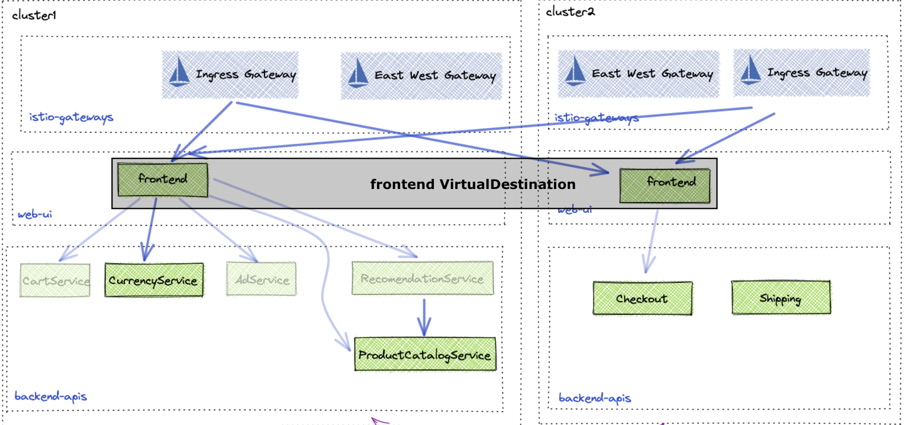

# Gloo Mesh Multicluster Routing Demo
```
export CLUSTER_CONTEXT1=gke_field-engineering-us_us-central1-c_rvennam-vddemo-1
export CLUSTER_CONTEXT2=gke_field-engineering-us_us-central1-c_rvennam-vddemo-2

export CLUSTER1=cluster1
export CLUSTER2=cluster2

export GLOO_MESH_LICENSE_KEY=
export GLOO_VERSION=2.5.1
```

Download `meshctl`
```
curl -sL https://run.solo.io/meshctl/install | GLOO_MESH_VERSION=v$GLOO_VERSION sh -
export PATH=$HOME/.gloo-mesh/bin:$PATH
```


# Install Gloo Mesh Management & Agent on Cluster 1

We'll use cluster1 as both our management and workload cluster. Typically, we recomment running the management in a separate cluster.

We'll use meshctl to install Gloo Mesh for demo purposes. In production, you would use helm and install the mgmt and agent separately.

```
meshctl install --register \
  --set common.cluster=$CLUSTER1 \
  --set glooMgmtServer.serviceType=LoadBalancer \
  --set telemetryGateway.enabled=true \
  --set istioInstallations.enabled=false \
  --set licensing.glooMeshLicenseKey=$GLOO_MESH_LICENSE_KEY
```

Get the IP address of the mgmt server and the telemetry gateway. These will be needed for the agent in cluster 2 to connect to it.
```
export TELEMETRY_GATEWAY_IP=$(kubectl get svc -n gloo-mesh gloo-telemetry-gateway  -o jsonpath='{.status.loadBalancer.ingress[0].ip}')
export TELEMETRY_GATEWAY_PORT=$(kubectl -n gloo-mesh get service gloo-telemetry-gateway -o jsonpath='{.spec.ports[?(@.name=="otlp")].port}')
export TELEMETRY_GATEWAY_ADDRESS=${TELEMETRY_GATEWAY_IP}:${TELEMETRY_GATEWAY_PORT}
echo $TELEMETRY_GATEWAY_ADDRESS
```

# Install Gloo Mesh Agent on Cluster 2
On cluster2, we don't need the mgmt server. We only need the agent, which will connect to the mgmt server in cluster1. 
```
meshctl cluster register $CLUSTER2 \
  --kubecontext $CLUSTER_CONTEXT1 \
  --remote-context $CLUSTER_CONTEXT2 \
  --profiles agent \
  --telemetry-server-address $TELEMETRY_GATEWAY_ADDRESS
```

# Install Istio on both clusters using Istio Lifecycle Management (ILM and GLM)

Install Istiod on cluster1:
```
kubectl apply --context ${CLUSTER_CONTEXT1} -f - <<EOF
apiVersion: admin.gloo.solo.io/v2
kind: IstioLifecycleManager
metadata:
  name: cluster1-installation
  namespace: gloo-mesh
spec:
  installations:
    - clusters:
      - name: cluster1
        defaultRevision: true
      revision: 1-19
      istioOperatorSpec:
        profile: minimal
        hub: us-docker.pkg.dev/gloo-mesh/istio-workshops
        tag: 1.19.3-solo
        namespace: istio-system
        values:
          global:
            meshID: mesh1
            multiCluster:
              clusterName: cluster1
            network: cluster1
          cni:
            excludeNamespaces:
            - istio-system
            - kube-system
            logLevel: info
        meshConfig:
          accessLogFile: /dev/stdout
          defaultConfig:
            proxyMetadata:
              ISTIO_META_DNS_CAPTURE: "true"
              ISTIO_META_DNS_AUTO_ALLOCATE: "true"
        components:
          pilot:
            k8s:
              env:
                - name: PILOT_ENABLE_K8S_SELECT_WORKLOAD_ENTRIES
                  value: "false"
          cni:
            enabled: true
            namespace: kube-system
          ingressGateways:
          - name: istio-ingressgateway
            enabled: false
EOF
```
Install Istiod on cluster2:
```
kubectl apply --context ${CLUSTER_CONTEXT1} -f - <<EOF
apiVersion: admin.gloo.solo.io/v2
kind: IstioLifecycleManager
metadata:
  name: cluster2-installation
  namespace: gloo-mesh
spec:
  installations:
    - clusters:
      - name: cluster2
        defaultRevision: true
      revision: 1-19
      istioOperatorSpec:
        profile: minimal
        hub: us-docker.pkg.dev/gloo-mesh/istio-workshops
        tag: 1.19.3-solo
        namespace: istio-system
        values:
          global:
            meshID: mesh1
            multiCluster:
              clusterName: cluster2
            network: cluster2
          cni:
            excludeNamespaces:
            - istio-system
            - kube-system
            logLevel: info
        meshConfig:
          accessLogFile: /dev/stdout
          defaultConfig:
            proxyMetadata:
              ISTIO_META_DNS_CAPTURE: "true"
              ISTIO_META_DNS_AUTO_ALLOCATE: "true"
        components:
          pilot:
            k8s:
              env:
                - name: PILOT_ENABLE_K8S_SELECT_WORKLOAD_ENTRIES
                  value: "false"
          cni:
            enabled: true
            namespace: kube-system
          ingressGateways:
          - name: istio-ingressgateway
            enabled: false
EOF
```
Install Ingress and East-West Gateways on cluster1:

```
kubectl apply --context ${CLUSTER_CONTEXT1} -f - <<EOF
apiVersion: admin.gloo.solo.io/v2
kind: GatewayLifecycleManager
metadata:
  name: cluster1-ingress
  namespace: gloo-mesh
spec:
  installations:
    - clusters:
      - name: cluster1
        activeGateway: false
      gatewayRevision: 1-19
      istioOperatorSpec:
        profile: empty
        hub: us-docker.pkg.dev/gloo-mesh/istio-workshops
        tag: 1.19.3-solo
        components:
          ingressGateways:
            - name: istio-ingressgateway
              namespace: istio-gateways
              enabled: true
              label:
                istio: ingressgateway
---
apiVersion: admin.gloo.solo.io/v2
kind: GatewayLifecycleManager
metadata:
  name: cluster1-eastwest
  namespace: gloo-mesh
spec:
  installations:
    - clusters:
      - name: cluster1
        activeGateway: false
      gatewayRevision: 1-19
      istioOperatorSpec:
        profile: empty
        hub: us-docker.pkg.dev/gloo-mesh/istio-workshops
        tag: 1.19.3-solo
        components:
          ingressGateways:
            - name: istio-eastwestgateway
              namespace: istio-gateways
              enabled: true
              label:
                istio: eastwestgateway
                topology.istio.io/network: cluster1
              k8s:
                env:
                  - name: ISTIO_META_ROUTER_MODE
                    value: "sni-dnat"
                  - name: ISTIO_META_REQUESTED_NETWORK_VIEW
                    value: cluster1
                service:
                  type: LoadBalancer
                  selector:
                    istio: eastwestgateway
                  # Default ports
                  ports:
                    # Port for health checks on path /healthz/ready.
                    # For AWS ELBs, this port must be listed first.
                    - name: status-port
                      port: 15021
                      targetPort: 15021
                    # Port for multicluster mTLS passthrough
                    # Gloo looks for this default name 'tls' on a gateway
                    # Required for Gloo east/west routing
                    - name: tls
                      port: 15443
                      targetPort: 15443
EOF
```

Install Ingress and East-West Gateways on cluster2:
```
kubectl apply --context ${CLUSTER_CONTEXT1} -f - <<EOF
apiVersion: admin.gloo.solo.io/v2
kind: GatewayLifecycleManager
metadata:
  name: cluster2-ingress
  namespace: gloo-mesh
spec:
  installations:
    - clusters:
      - name: cluster2
        activeGateway: false
      gatewayRevision: 1-19
      istioOperatorSpec:
        profile: empty
        hub: us-docker.pkg.dev/gloo-mesh/istio-workshops
        tag: 1.19.3-solo
        components:
          ingressGateways:
            - name: istio-ingressgateway
              namespace: istio-gateways
              enabled: true
              label:
                istio: ingressgateway
---
apiVersion: admin.gloo.solo.io/v2
kind: GatewayLifecycleManager
metadata:
  name: cluster2-eastwest
  namespace: gloo-mesh
spec:
  installations:
    - clusters:
      - name: cluster2
        activeGateway: false
      gatewayRevision: 1-19
      istioOperatorSpec:
        profile: empty
        hub: us-docker.pkg.dev/gloo-mesh/istio-workshops
        tag: 1.19.3-solo
        components:
          ingressGateways:
            - name: istio-eastwestgateway
              namespace: istio-gateways
              enabled: true
              label:
                istio: eastwestgateway
                topology.istio.io/network: cluster2
              k8s:
                env:
                  - name: ISTIO_META_ROUTER_MODE
                    value: "sni-dnat"
                  - name: ISTIO_META_REQUESTED_NETWORK_VIEW
                    value: cluster2
                service:
                  type: LoadBalancer
                  selector:
                    istio: eastwestgateway
                  # Default ports
                  ports:
                    # Port for health checks on path /healthz/ready.
                    # For AWS ELBs, this port must be listed first.
                    - name: status-port
                      port: 15021
                      targetPort: 15021
                    # Port for multicluster mTLS passthrough
                    # Gloo looks for this default name 'tls' on a gateway
                    # Required for Gloo east/west routing
                    - name: tls
                      port: 15443
                      targetPort: 15443
EOF
```

# Unify trust on both clusters
```
cat << EOF | kubectl --context ${CLUSTER_CONTEXT1} apply -f -
apiVersion: admin.gloo.solo.io/v2
kind: RootTrustPolicy
metadata:
  name: root-trust-policy
  namespace: gloo-mesh
spec:
  config:
    mgmtServerCa:
      generated: {}
    autoRestartPods: true
EOF
```

# Deploy Online Boutique Sample
Cluster 1:
```
kubectl apply --context $CLUSTER_CONTEXT1 -f https://raw.githubusercontent.com/solo-io/solo-cop/main/workshops/gloo-mesh-demo/install/online-boutique/backend-apis.yaml
kubectl apply --context $CLUSTER_CONTEXT1 -f https://raw.githubusercontent.com/rvennam/gloo-mesh-multicluster-routing-demo/main/web-ui-cluster1.yaml
```

Cluster 2:
```
kubectl apply --context $CLUSTER_CONTEXT2 -f https://raw.githubusercontent.com/solo-io/solo-cop/main/workshops/gloo-mesh-demo/install/online-boutique/backend-apis.yaml
kubectl apply --context $CLUSTER_CONTEXT2 -f https://raw.githubusercontent.com/rvennam/gloo-mesh-multicluster-routing-demo/main/web-ui-cluster2.yaml
```

# Create Workspaces


We'll create these namespaces on cluster1 to store each team's mesh configuration.
```
kubectl create namespace ops-team --context $CLUSTER_CONTEXT1
kubectl create namespace web-team --context $CLUSTER_CONTEXT1
kubectl create namespace backend-apis-team --context $CLUSTER_CONTEXT1
```

Create the workspaces:
```
kubectl --context ${CLUSTER_CONTEXT1} apply -f - <<EOF
apiVersion: admin.gloo.solo.io/v2
kind: Workspace
metadata:
  name: ops-team
  namespace: gloo-mesh
spec:
  workloadClusters:
  - name: '*'
    namespaces:
    - name: ops-team
    - name: istio-gateways
    - name: gloo-mesh-addons
---
apiVersion: admin.gloo.solo.io/v2
kind: Workspace
metadata:
  name: web-team
  namespace: gloo-mesh
spec:
  workloadClusters:
  - name: '*'
    namespaces:
    - name: web-ui
    - name: web-team
---
apiVersion: admin.gloo.solo.io/v2
kind: Workspace
metadata:
  name: backend-apis-team
  namespace: gloo-mesh
spec:
  workloadClusters:
  - name: '*'
    namespaces:
    - name: backend-apis-team
    - name: backend-apis
EOF
```

Workspace Settings:
```
kubectl apply --context $CLUSTER_CONTEXT1 -f https://raw.githubusercontent.com/solo-io/solo-cop/main/workshops/gloo-mesh-demo/tracks/02-workspaces/workspace-settings.yaml
```

# Expose the web-ui app on both clusters


Set up a HTTP (80) listener on the ingress gateway in both clusters:
```
kubectl --context ${CLUSTER_CONTEXT1} apply -f - <<EOF
apiVersion: networking.gloo.solo.io/v2
kind: VirtualGateway
metadata:
  name: north-south-gw
  namespace: ops-team
spec:
  workloads:
    - selector: # Select the gateway across both clusters
        labels:
          istio: ingressgateway
        namespace: istio-gateways
  listeners: 
    - http: {}
      port:
        number: 80
      allowedRouteTables:
        - host: '*'
          selector:
            workspace: web-team
EOF
```

Apply the RouteTable for the web team to define where traffic for the gateway should go.
```
kubectl --context ${CLUSTER_CONTEXT1} apply -f - <<EOF
apiVersion: networking.gloo.solo.io/v2
kind: RouteTable
metadata:
  name: frontend
  namespace: web-team
spec:
  hosts:
    - '*'
  virtualGateways:
    - name: north-south-gw
      namespace: ops-team
      cluster: cluster1
  workloadSelectors: []
  http:
    - name: frontend
      forwardTo:
        destinations:
          - ref:
              name: frontend # The service where traffic should go to
              namespace: web-ui
            port:
              number: 80
EOF
```

Each ingress gateway now routes to the local frontend service. But if the frontend fails, traffic can not failover! For that, we need multi-cluster routing using VirtualDestinations!

# Virtual Destination for frontend service



```
kubectl --context ${CLUSTER_CONTEXT1} apply -f - <<EOF
apiVersion: networking.gloo.solo.io/v2
kind: VirtualDestination
metadata:
  name: frontend
  namespace: web-team
spec:
  hosts:
  - frontend.web-ui-team.solo-io.mesh
  services:
  - labels:
      app: frontend
  ports:
  - number: 80
    protocol: HTTP
    targetPort:
      name: http
EOF
```

Now, let's update the previous RouteTable to now send traffic to this VirtualDestination instead:

```
kubectl --context ${CLUSTER_CONTEXT1} apply -f - <<EOF
apiVersion: networking.gloo.solo.io/v2
kind: RouteTable
metadata:
  name: frontend
  namespace: web-team
  labels:
    lab: failover
spec:
  hosts:
    - '*'
  virtualGateways:
    - name: north-south-gw
      namespace: ops-team
      cluster: cluster1
  workloadSelectors: []
  http:
    - name: frontend
      labels:
        virtual-destination: frontend
      forwardTo:
        destinations:
          - ref:
              name: frontend # VirtualDestination for frontend
              namespace: web-team
            kind: VIRTUAL_DESTINATION
            port:
              number: 80
EOF
```
Voila! You now have ingress gateways on both clusters routing across frontend applications on both clusters!


# Locality Load Balancing

```
kubectl --context ${CLUSTER_CONTEXT1} apply -f - <<EOF
apiVersion: resilience.policy.gloo.solo.io/v2
kind: FailoverPolicy
metadata:
  name: failover
  namespace: web-team
spec:
  applyToDestinations:
  - kind: VIRTUAL_DESTINATION
    selector:
      namespace: web-team
  config:
    # enable default locality based load balancing
    localityMappings: []
EOF
```

```
kubectl --context ${CLUSTER_CONTEXT1} apply -f - <<EOF
apiVersion: resilience.policy.gloo.solo.io/v2
kind: OutlierDetectionPolicy
metadata:
  name: outlier-detection
  namespace: web-team
spec:
  applyToDestinations:
  - kind: VIRTUAL_DESTINATION
    selector:
      namespace: web-team
  config:
    consecutiveErrors: 2
    interval: 5s
    baseEjectionTime: 15s
    maxEjectionPercent: 100
EOF
```